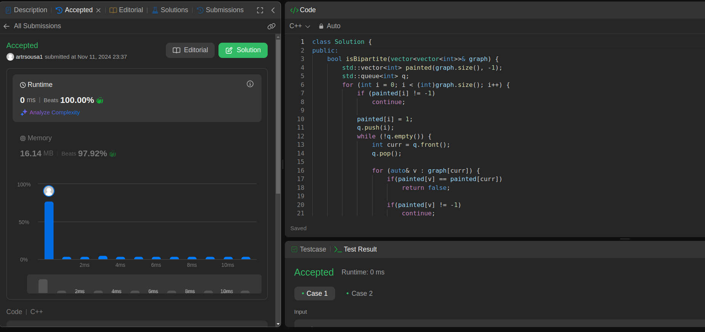
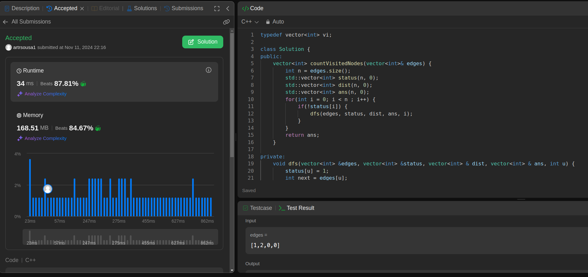

**!! Atenção: Renomeie o seu repositório para (Tema)_(NomeDoProjeto). !!** 

Temas:
 - Grafos1
 - Grafos2
 - PD
 - D&C
 - Greed
 - Final 
 
 **!! *Não coloque os nomes dos alunos no título do repositório*. Exemplo de título correto: Grafos2_Labirinto-do-Minotauro !!**
 
 (Apague essa seção)

# Grafos 1 -  LeetCode e BeeCrowd

**Número da Lista**: 1 
**Conteúdo da Disciplina**: Grafos 1 

## Alunos
|Matrícula | Aluno |
| -- | -- |
| 221007850 |  Arthur Ribeiro e Sousa |
| xx/xxxxxx  |  Henrique Camelo Quenino |

## Sobre 
Esse projeto consiste na resolução de problemas do LeetCode e do BeeCrowd, utilizando algoritmos de grafos. 

## Problemas

| Problema | Código | Dificuldade | Responsável |
| -- | -- | -- | -- |
| [Is Graph Bipartite](https://leetcode.com/problems/is-graph-bipartite/description/) | 785 | Média | Arthur |
| [Count Visited Nodes in a Directed Graph](https://leetcode.com/problems/count-visited-nodes-in-a-directed-graph/description/) | 2876 | Difícil | Arthur |

## Screenshots

### Is Graph Bipartite

### Count Visited Nodes in a Directed Graph

## Vídeos de explicação

### Is Graph Bipartite 

<iframe width="560" height="315" src="https://www.youtube.com/embed/lAJFr5XU7vM?si=2ok9fpWp6WjrGl2h" title="YouTube video player" frameborder="0" allow="accelerometer; autoplay; clipboard-write; encrypted-media; gyroscope; picture-in-picture; web-share" referrerpolicy="strict-origin-when-cross-origin" allowfullscreen></iframe>

### Count Visited Nodes in a Directed Graph

<iframe width="560" height="315" src="https://www.youtube.com/embed/PzhO-wy4Z0U?si=qXGtO0AZPjKX57dK" title="YouTube video player" frameborder="0" allow="accelerometer; autoplay; clipboard-write; encrypted-media; gyroscope; picture-in-picture; web-share" referrerpolicy="strict-origin-when-cross-origin" allowfullscreen></iframe>
