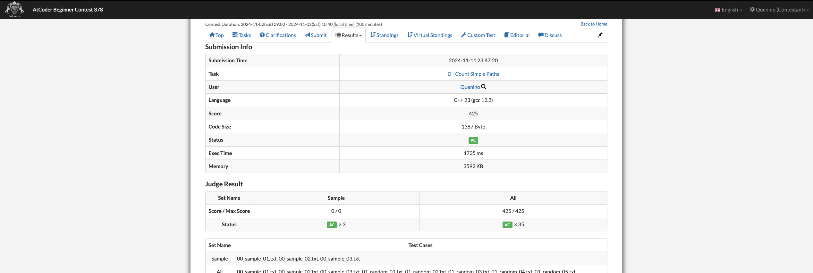
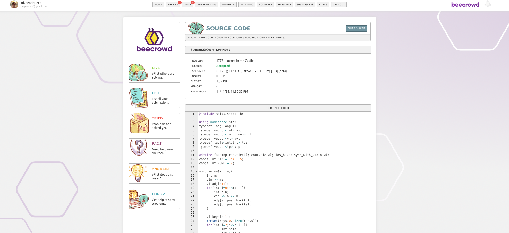

# Grafos 1 -  LeetCode e BeeCrowd

**Número da Lista**: 1 
**Conteúdo da Disciplina**: Grafos 1 

## Alunos
|Matrícula | Aluno |
| -- | -- |
| 221007850 |  Arthur Ribeiro e Sousa |
| 221008098  |  Henrique Camelo Quenino |

## Sobre 
Esse projeto consiste na resolução de problemas do LeetCode e do BeeCrowd, utilizando algoritmos de grafos. 

## Problemas

| Problema | Código | Dificuldade | Responsável |
| -- | -- | -- | -- |
| [Is Graph Bipartite](https://leetcode.com/problems/is-graph-bipartite/description/) | 785 | Média | Arthur |
| [Count Visited Nodes in a Directed Graph](https://leetcode.com/problems/count-visited-nodes-in-a-directed-graph/description/) | 2876 | Difícil | Arthur |
| [Locked in the Castle](https://judge.beecrowd.com/en/problems/view/1773) | 1773 | Difícil | Henrique | 
| [Count Simple Paths](https://atcoder.jp/contests/abc378/tasks/abc378_d) | 378 D | Média | Henrique |

## Screenshots

### Is Graph Bipartite

### Count Visited Nodes in a Directed Graph

### Count Simple Paths 

### Locked in the Castle

## Vídeos de explicação

### Is Graph Bipartite 

[Is Graph Bipartite](https://www.youtube.com/watch?v=lAJFr5XU7vM)

### Count Visited Nodes in a Directed Graph

[Count Visited Nodes in a Directed Graph](https://youtu.be/PzhO-wy4Z0U?si=OP4n193tUzPmcxtB)

### Count Simple Paths 

[Count Simple Paths](https://youtu.be/CvpVDliEehc)

### Locked in the Castle

[Locked in the Castle](https://youtu.be/riGQJuBGU58)
